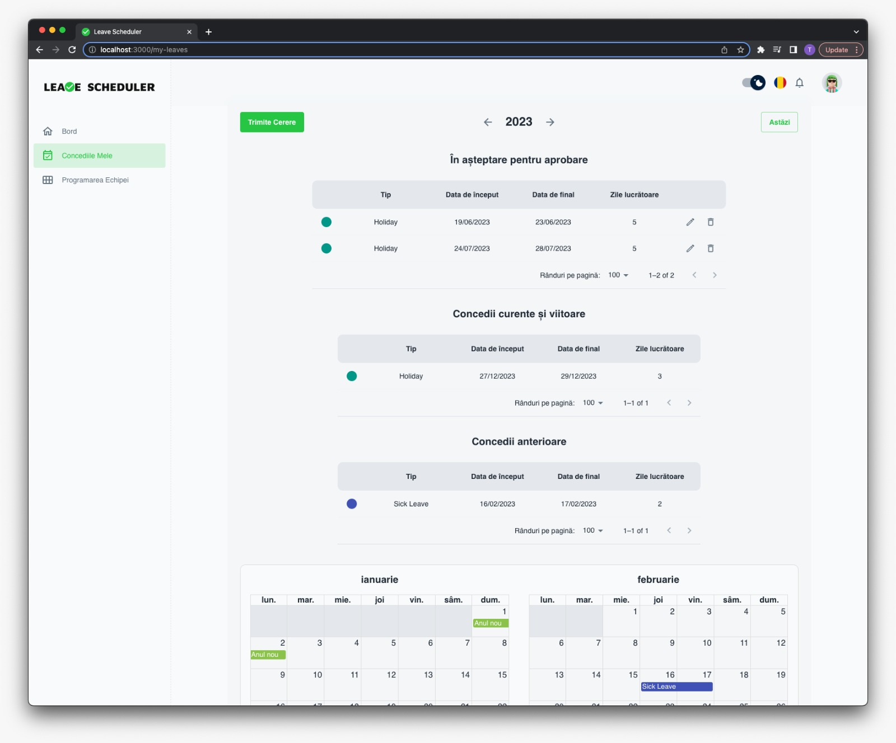

# Leave Scheduler


## Overview
Leave Scheduler is a responsive web application designed to streamline employee leave management for organizations. The application allows managers and employees to manage leave requests efficiently, providing real-time updates on leave balances, approvals, and schedules. Leveraging **`React`** for the frontend with **`Material UI`** for styling, and **`Node.js`** with **`Express`** for the backend, Leave Scheduler connects to a **`MongoDB`** database and utilizes **`GraphQL`** for efficient data querying and manipulation.


## How To Run

### Clone the repositories
```sh
$ git clone https://github.com/StiopAlexandra/LeaveScheduler.git
```

### Set environment variables
To set up your project, follow these steps:
1. In each directory (client and server), create a new .env file by duplicating .env.sample
2. Set up your MongoDB connection:
   * Create a MongoDB database using MongoDB Atlas or your preferred MongoDB service.
   * Copy the connection string provided by MongoDB and add it to the .env file in the server directory.
3. Add Nodemailer credentials in the server/.env file to enable email functionality.   

### Install the dependencies and run the application:
Navigate to the project root and install the dependencies for both client and server:
```sh
$ npm install
```
Start the application in development mode:
```sh
$ npm run watch
```
# Web application screenshots

| <p align="center">**Login**</p>          | <p align="center">**Dashboard**</p>          | <p align="center">**Company Details**</p>                |
|------------------------------------------|----------------------------------------------|----------------------------------------------------------|
|               |               |                     |
| <p align="center">**Types of Leave**</p> | <p align="center">**Adding an Employee**</p> | <p align="center">**Pending Requests**</p>               |
|      |      |                       |
| <p align="center">**Notifications**</p>  | <p align="center">**My Leaves**</p>          | <p align="center">**Email Received**</p> |
|       |               |                       |

